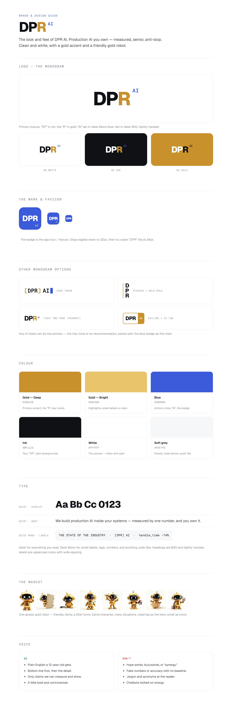

# 1 · Design Guide

The look and feel of **DPR AI**. Clean and white, a gold accent, a blue for action, and a friendly gold robot.

---

## Logo

The brand is **DPR AI** (no "Labs"). The mark is a **monogram** built from D, P, R.

**Primary logo — the two‑tone wordmark:** "DP" in ink, the **R** in gold, "AI" set small in Geist Mono blue. Set in Geist 800, tightly tracked.

| Use | What to use |
|-----|-------------|
| Main logo | The two‑tone **DP·R AI** wordmark |
| App icon / favicon | The blue **badge** (rounded square, "DPR" in white, tiny gold "AI") |
| On dark backgrounds | Same wordmark, "DP" turns white, R stays gold |
| Tiny sizes (≤24px) | Badge drops the "AI" and shows a plain "DPR" tile |

**Other options on the table** (see `assets/logo-options.png`): a `[DPR] AI` code token, a stacked D/P/R with a gold rule, and a keyline + "AI" tab. Any can be primary — pick one and I'll lock it in.

> **Clear space:** keep space equal to the height of the "D" around the logo. **Don't** recolour it, stretch it, add a gradient, or put it on a busy photo.

---

## Colour

| Role | Name | Hex |
|------|------|-----|
| Primary accent (the "R", key marks) | Gold — Deep | `#C8912B` |
| Highlights, details on dark | Gold — Bright | `#E9C46A` |
| Actions, links, "AI", the badge | Blue | `#3B5BDB` |
| Text and dark backgrounds | Ink | `#0A0A0B` |
| The canvas | White | `#FFFFFF` |
| Quiet panels & code blocks | Soft grey | `#F7F7F8` |

> **Rule of thumb:** white does most of the work. Gold is the accent (use it sparingly — it's special). Blue means "you can act here" (links, buttons, the AI tag).

---

## Type

Two fonts, both from Google Fonts, already loaded on the site.

| Font | Where it's used |
|------|-----------------|
| **Geist** | Everything you read — headings and body. Headings are weight 800, tightly tracked. |
| **Geist Mono** | Small labels, tags, numbers, and anything code‑like — UPPERCASE with wide letter‑spacing. |

Example label style: `THE STATE OF THE INDUSTRY` · `[DPR] AI` · `handle_time -74%`

---

## The mascot

One glossy **gold robot** — friendly, techy, a little funny. The rule: **same character, many situations.** Big as the hero up top, small as the "AI slop" icons (bolted‑on, unplugged, rented, show‑off, theater, blindly shipping, consultant).

> Generate new poses with ComfyUI using the same character description so every robot looks like the same guy.

---

## Voice

**Do**
- Plain English a 12‑year‑old gets.
- Bottom line first, then the detail.
- Only claims we can measure and show.
- A little bold and controversial.

**Don't**
- Hype words, buzzwords, or "synergy."
- Fake numbers or accuracy with no baseline.
- Jargon and acronyms thrown at the reader.
- Chatbot‑bolted‑on energy.
